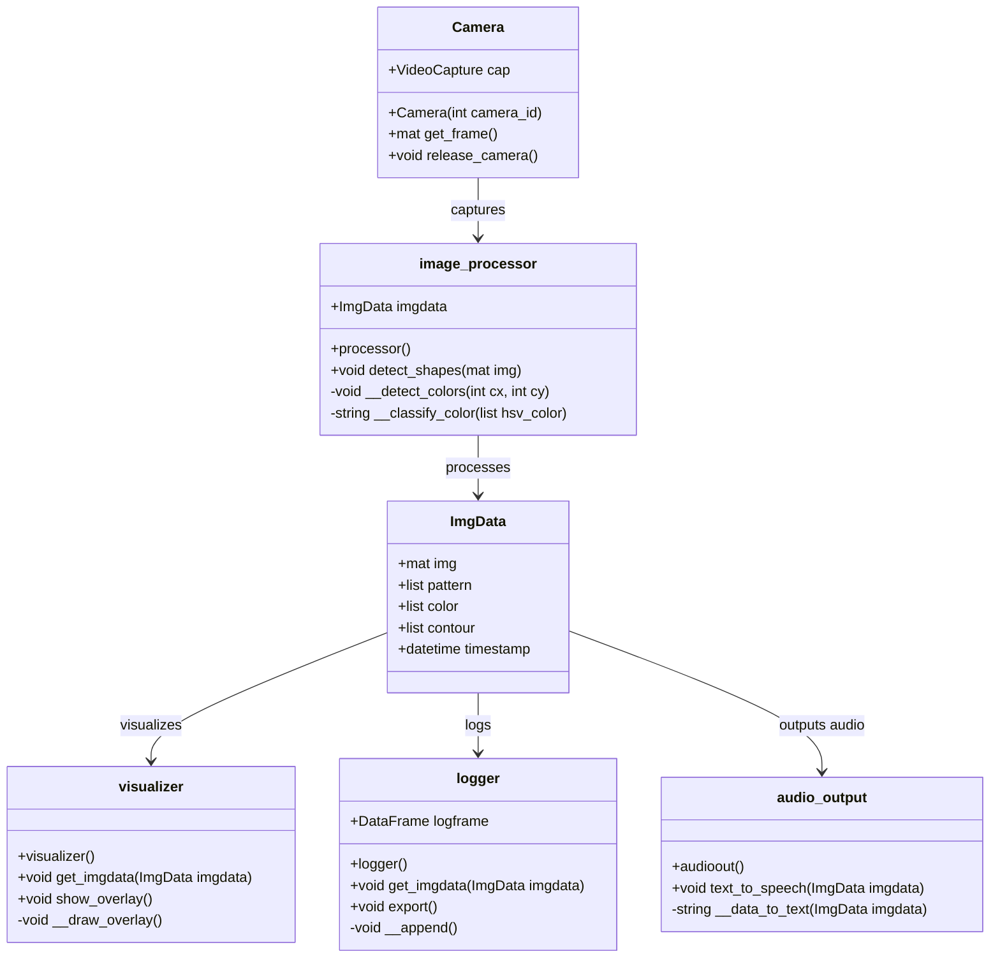
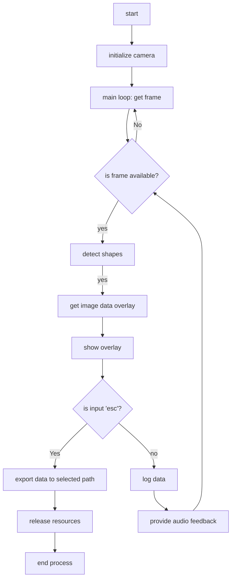

# Live Object Pattern Recognition and Color Detection

This repository contains a Python application that uses computer vision techniques to detect information on shapes in a video feed. It draws marks on the video to show where the shapes are and also talks out loud to tell you what it sees. Every shape it finds is also written down in a file so you can look back at what it found later.


## Table of Contents

- [Live Object Pattern Recognition and Color Detection](#live-object-pattern-recognition-and-color-detection)
  - [Table of Contents](#table-of-contents)
  - [Installation](#installation)
  - [Usage](#usage)
  - [Features](#features)
  - [Class-Diagram](#class-diagram)
  - [Flowchart](#flowchart)

## Installation

To set up this project locally, follow these steps:

1. Clone the repository:
```
git clone https://github.com/hermanndererdmann/softwareeng.git
```  
2. Navigate to the src folder

## Usage

To run the application, execute the following command in the terminal:
```
python3 main.py
```
Press 'Esc' to exit the application at any time.

## Features

This shape detection application leverages computer vision to provide real-time analysis of shapes in a video feed. Below are some of the core features:

- **Real-Time Shape Detection**: Utilize advanced algorithms to detect shapes in a live video feed, highlighting them in the user interface.

- **Color Identification**: Beyond shape recognition, the application can identify and classify colors of the detected objects.

- **Dynamic Overlays**: As shapes are recognized, the application draws overlays on the video feed to mark detected shapes with their respective names and color information.

- **Audio Feedback**: The application provides auditory feedback by using text-to-speech technology to verbally announce the detected shapes and colors.

- **Logging and Data Export**: Detected shapes, colors, and timestamps are logged for retrospective analysis. The logged data can be exported to a CSV file for further analysis or archiving.

- **User Interface**: A simple and intuitive interface that displays the video feed with overlays and provides real-time updates as objects are detected.

- **Graceful Shutdown**: Users can exit the application at any point with a simple key press, ensuring all resources are properly released and data is saved.

To experience these features, follow the installation and usage instructions to set up the application on your local machine.

## Class-Diagram



## Flowchart

